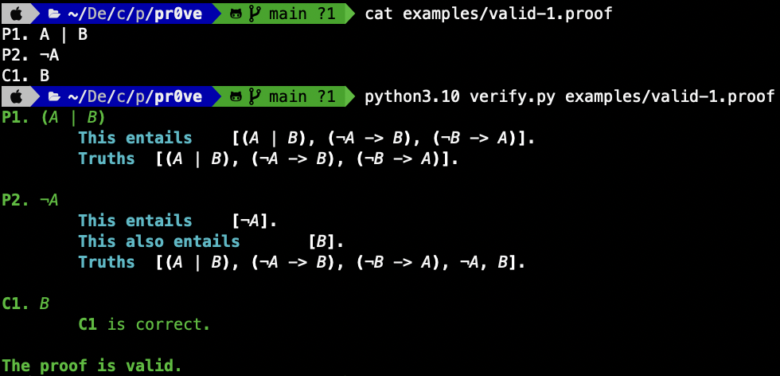

# pr0ve

pr0ve is a proof verifier for 0th-order logic. It is based upon ideas from
the wonderful [forall x](https://www.fecundity.com/logic/).

The file `verify.py` can be run on a proof file to find if the proof is valid
or not:



This certainly will not correctly verify every possible proof, but will work
with basic ones.

## Usage

Proofs are written as a series of premises ("P1", "P2", etc.) and conclusions.
Each of these contains a sentence, which consists of some combination of
letters, operators, and brackets.

The supported operators are `&` (and), `->` (implies), `|` (or), and `¬` (not).

Some example sentences (they are not necessarily consistent):

```
A
A & B
A | B
A -> C
¬X -> (A & B)
X | (Y -> ¬X)
```

And an example argument:

```
P1. B -> C
P2. B
C1. C
```

This argument is valid, and can be verified using this program. More example
arguments can be found in the `examples` folder.
